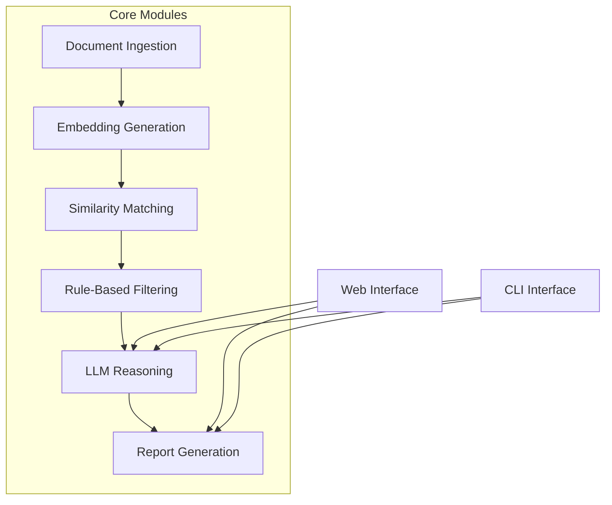

# 📄 AI-Powered Tender Proposal Evaluation System

<p align="center">
  
  
  
</p>

<p align="center">
  <strong>An intelligent system for automated evaluation of tender proposals using AI and semantic analysis</strong>
</p>

## 🌟 Overview

The **Tender Proposal Evaluation System** is an advanced AI-powered solution designed to streamline the tender evaluation process. By leveraging natural language processing, semantic similarity matching, and large language models, this system provides objective, consistent, and comprehensive evaluation of tender proposals against organizational requirements.

### 🔍 Key Benefits

- **⏱️ Time Savings**: Automate hours of manual document review
- **🎯 Objective Scoring**: Eliminate human bias with AI-driven analysis
- **📊 Detailed Insights**: Get comprehensive evaluation reports with actionable insights
- **🖥️ User-Friendly**: Intuitive web interface for easy operation
- **📄 Professional Reports**: Generate polished PDF reports automatically

## 🚀 Features

| Feature | Description |
|---------|-------------|
| **📄 Document Processing** | Extracts text from PDF documents using pdfplumber with OCR fallback |
| **🧠 Semantic Analysis** | Converts documents to embeddings using Ollama nomic-embed-text model |
| **🔍 Similarity Matching** | Finds semantic similarity between requirements and proposals using cosine similarity |
| **🤖 LLM Evaluation** | Provides detailed scoring and analysis using Ollama llama3.1 model |
| **📑 Professional Reporting** | Generates structured LaTeX reports compiled to PDF |
| **🌐 Web Interface** | User-friendly Streamlit interface for easy interaction |

## 🏗️ System Architecture



*Note: A visual diagram of the system architecture can be found in the docs/images/ folder.*

## 📋 Prerequisites

- **Python 3.8 or higher**
- **Ollama** (for embeddings and LLM evaluation)
- **LaTeX distribution** (MiKTeX for Windows, TeX Live for Linux/Mac) for PDF generation
- **Tesseract OCR** *(optional)* for scanned PDFs

## 🛠️ Installation

### 1. Clone the Repository

```bash
git clone <repository-url>
cd tender-proposal-evaluation-system
```

### 2. Install Dependencies

```bash
pip install -r requirements.txt
```

### 3. Install Ollama

Download and install Ollama from [https://ollama.com/](https://ollama.com/)

### 4. Pull Required Models

```bash
ollama pull nomic-embed-text
ollama pull llama3.1
```

### 5. Install LaTeX Distribution

Choose your platform:

<details>
<summary>Windows</summary>

Install MiKTeX from [https://miktex.org/](https://miktex.org/)
</details>

<details>
<summary>Linux</summary>

```bash
sudo apt-get install texlive-full
```
</details>

<details>
<summary>MacOS</summary>

Install MacTeX from [https://www.tug.org/mactex/](https://www.tug.org/mactex/)
</details>

## ▶️ Usage

### Web Interface (Recommended) 🔥

Run the professional Streamlit interface:

```bash
streamlit run src/interfaces/professional_streamlit_app.py
```

Or use the provided launcher script:

```bash
python run_app.py
```

The web interface will be available at `http://localhost:8504` (or another port if 8504 is occupied).

### Command Line Interface

Run the system in CLI mode:

```bash
python main.py --mode cli
```

## ⚙️ Configuration

The system can be configured through `config/config.yaml`:

- **Ollama Settings**: Configure base URL and model names
- **Evaluation Settings**: Set maximum applicants and scoring thresholds
- **OCR Settings**: Enable/disable OCR and set language
- **Processing Settings**: Adjust chunk sizes and similarity search parameters

### Evaluation Settings in Web Interface

| Setting | Description | Range |
|---------|-------------|-------|
| **Maximum Proposals** | Set the maximum number of proposals to process | 1-50 |
| **Minimum Score Threshold** | Minimum compliance score for inclusion | 0-100 |
| **Ollama Settings** | Configure base URL and model names | - |
| **OCR Settings** | Enable/disable OCR processing | - |

## 📊 Report Generation

The system generates professional PDF reports with:

1. **Executive Summary** - Overview of the evaluation
2. **Requirements Analysis** - Organization requirements breakdown
3. **Comparison Tables** - Technical and financial match analysis
4. **Individual Evaluations** - Detailed scores and recommendations
5. **Methodology Documentation** - Process explanation

Reports are generated as LaTeX files and automatically compiled to PDF if a LaTeX distribution is available. If LaTeX is not available, the system will provide the LaTeX source file which can be compiled manually.

##  troubleshoot Troubleshooting

### Ollama Connection Issues

If you encounter connection issues with Ollama:
1. Ensure Ollama is running: `ollama serve`
2. Check that the base URL in config.yaml matches your Ollama installation
3. Verify that the required models are pulled: `ollama list`

### PDF Generation Issues

If PDF reports are not generated:
1. Ensure a LaTeX distribution is installed
2. Verify that `pdflatex` is in your system PATH
3. Check the terminal output for LaTeX compilation errors

### OCR Processing

For better OCR results:
1. Install Tesseract OCR
2. Ensure the `pytesseract` package is installed
3. Set the correct Tesseract executable path in the system PATH

## 📁 Project Structure

```
tender-proposal-evaluation-system/
├── config/
│   └── config.yaml              # System configuration
├── data/
│   ├── org_documents/           # Organization requirement documents
│   ├── applicant_documents/     # Applicant proposal documents
│   ├── reports/                 # Generated reports
│   └── vectorstore/             # Vector database storage
├── src/
│   ├── embeddings/              # Embedding generation module
│   ├── evaluation/              # LLM evaluation module
│   ├── filtering/               # Rule-based filtering module
│   ├── ingestion/               # Document ingestion module
│   ├── interfaces/              # User interfaces (CLI and web)
│   ├── ocr/                     # OCR processing module
│   ├── parsing/                 # Text processing module
│   ├── reporting/               # Report generation module
│   ├── search/                  # Similarity search module
│   ├── utils/                   # Utility functions
│   └── vector_db/               # Vector database management
├── templates/
│   └── report_template.tex      # LaTeX report template
├── main.py                      # Main entry point
├── run_app.py                   # Streamlit app launcher
├── requirements.txt             # Python dependencies
└── README.md                   # This file
```

## 🤝 Contributing

Contributions are welcome! Here's how you can contribute:

1. Fork the repository
2. Create a feature branch (`git checkout -b feature/AmazingFeature`)
3. Commit your changes (`git commit -m 'Add some AmazingFeature'`)
4. Push to the branch (`git push origin feature/AmazingFeature`)
5. Open a Pull Request

## 📄 License

This project is licensed under the MIT License - see the [LICENSE](LICENSE) file for details.

## 📧 Contact

For questions, issues, or feedback, please open an issue on this repository.

---

<p align="center">
  Made with ❤️ by Prakash 
</p>